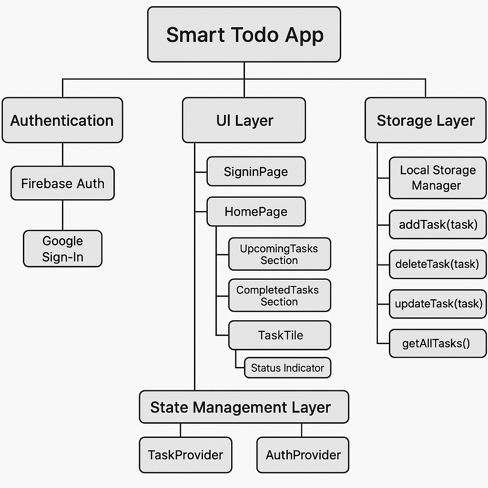

# Smart Todo App

Smart Todo is a clean and simple to-do app with Google Sign-In, local task storage, and smart categorization (Upcoming, Past Due, Completed).

## Features

- ✅ Google Sign-In
- ✅ Add, Edit, Delete tasks
- ✅ Task Priority and Due Date
- ✅ Smart Task Grouping
- ✅ Local Storage with Shared Preferences

## Architecture

## Demo Video

[Video Walkthrough](https://drive.google.com/file/d/1fAAyk_aQ0REZU30kRLNIjrC9SFI26grp/view?usp=sharing)

## APK Download

[Download the latest APK here](https://drive.google.com/file/d/1A-KxiE9z5k6ObbWRfviWf-ObAeQqywOE/view?usp=sharing)

## Assumptions

- Only Google Sign-In is supported.
- Data is stored locally.
- No cloud sync or backend so far.

## Tools Used

- Flutter
- Firebase Auth
- Shared Preferences
- ChatGPT (for guidance and architecture)

---

This project is a part of a hackathon run by [https://www.katomaran.com](https://www.katomaran.com)
